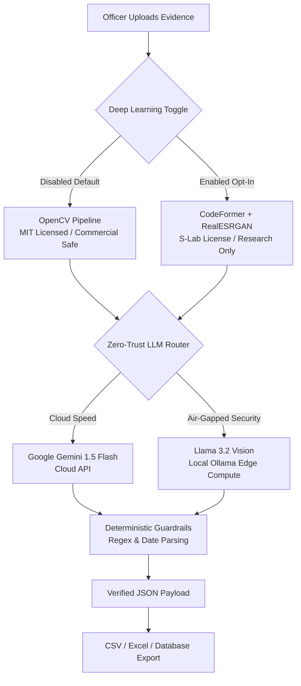

# Police Forensics AI: Cyber Command Terminal 🚓

Welcome to the **Police Forensics AI** documentation. This project is an enterprise-grade, secure evidence extraction system architected specifically for law enforcement and intelligence precincts. 

By leveraging cutting-edge Deep Learning GANs (CodeFormer/Real-ESRGAN) to mathematically restore degraded surveillance footage, and state-of-the-art Vision-Language Models (Google Gemini & Llama 3.2 Vision) for deterministic data extraction, this system automates evidence processing with zero-trust security.

## 🚀 Core Architecture Features

- **Dual-Tier Image Preprocessing (Licensing Strategy):** 
  - **OpenCV Pipeline (Default - MIT):** Utilizes dynamic contrast normalization and mathematical edge-detection to prepare evidence for OCR. This path is 100% MIT-licensed, making it strictly safe for commercial enterprise deployment.
  - **CodeFormer GAN (Opt-In - S-Lab):** For heavily degraded inputs, users can explicitly toggle the Deep Learning PyTorch bridge. This runs CodeFormer to computationally restore human faces and background text. *(Note: This path invokes an S-Lab Non-Commercial license and requires strict legal clearance).*
- **Zero-Trust Pluggable LLM Routing:** 
  - **Cloud-Edge (Gemini 1.5 Flash):** Lightning-fast structured extraction via API for standard, non-classified evidence.
  - **Air-Gapped Offline (Llama 3.2 Vision):** 100% offline edge-compute routing via local Ollama for maximum security on highly classified intranet networks.
- **Deterministic Anti-Hallucination Guardrails:** Implements strict SpaCy Named Entity Recognition (NER), fuzzy date parsing, and regex validation to intercept and eliminate AI hallucinations before database entry.
- **Exporting Capabilities:** Seamlessly exports extracted JSON data into flat CSV and Excel reports for precinct archives.

## System Architecture (MLOps & Zero-Trust)

This project is built using enterprise MLOps patterns, specifically focusing on **Dynamic Licensing Routing** (separating commercial math from non-commercial GANs) and **Zero-Trust Edge-to-Cloud fallback**.

## Installation & Setup

### 1. Developer Setup (Python Environment)
1. Clone the repository: `git clone https://github.com/your-username/PoliceForensicsAI.git`
2. Create a virtual environment: `python -m venv venv`
3. Activate the environment: `.\venv\Scripts\Activate` (Windows) or `source venv/bin/activate` (Mac/Linux)
4. Install dependencies: `pip install -r requirements.txt`
5. Copy `.env.example` to `.env` and insert your Gemini API Key.
6. Run the application: `python src/app.py`

### 2. Standalone Windows Desktop App
For non-technical officers, you can download the standalone `.exe` folder.
1. Run `.\scripts\build_executable.ps1` to compile the application using PyInstaller.
2. Distribute the generated `dist/CyberTerminal/` folder to precinct laptops. No Python installation required!

### 3. Docker Deployment
For IT infrastructure deployment:
1. Build the image: `docker build -t police-forensics-ai .`
2. Run the container: `docker run -p 7860:7860 police-forensics-ai`

## Project Architecture
- `src/app.py`: The Gradio User Interface.
- `src/ocr_engine.py`: The orchestration layer managing LLMs and Guardrails.
- `src/modules/codeformer_bridge.py`: The PyTorch bridge interfacing with the GAN.
- `tests/test_evaluation.py`: The rigorous unit testing suite evaluating WER and Entity Accuracy against the 100-case Golden Matrix.

## License
This project is released under the permissive [MIT License](LICENSE).
